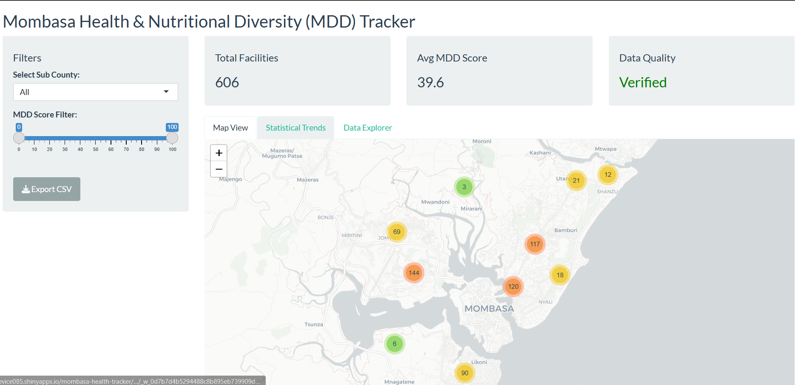
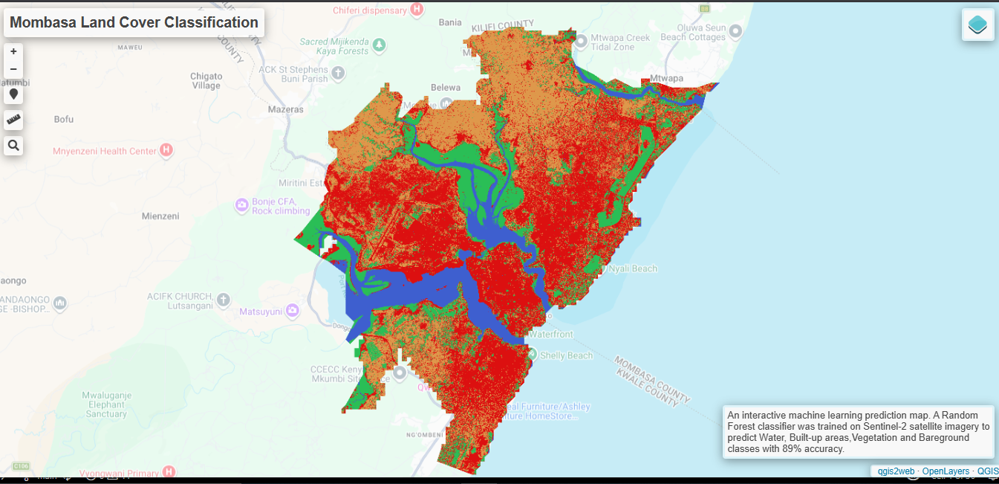

## Introduction

I build intelligent systems at the intersection of **AI, geospatial analytics, and data science** to turn complex data into real-world impact.

I am a Geospatial Engineer and aspiring AI practitioner passionate about using machine learning, data, and spatial intelligence to solve challenges in climate resilience, public health, and sustainable development.

---

## Featured Projects

::::{grid} 2 2 2 2

:::{card}
:link: https://year5project-3ackjxfnliyympfesgbfs3.streamlit.app/

+++
**UHI Prediction**
:::

:::{card}
:link: https://customerchurnprediction-rx5gddzerehu3dunbgorrc.streamlit.app/

+++
**Customer churn**
:::

:::{card}
:link: https://levice085.shinyapps.io/mombasa-health-tracker/

+++
**Health tracker**
:::

:::{card}
:link: https://levice085.github.io/mombasa_ml_classification/

+++
**Land Classification**
:::

::::

---